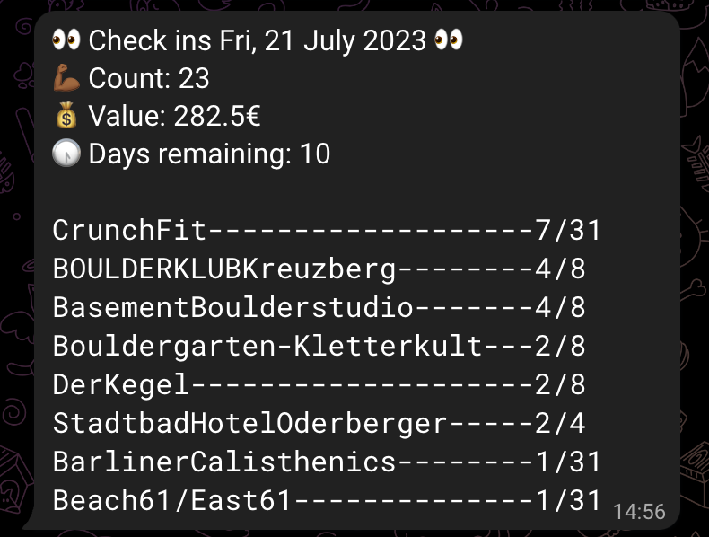

# Urban Sports Club CheckIn Scraper

A scraper to check if Im close to exceeding my monthly checkins with Urban Sports Club. Because they dont provide that service for some reason. 

Uses Selenium to login and fetch checkins, writes those to an SQLite DB, and sends the counts and aggregated values to Telegram. Caches smaller browser requests and all pages of checkins, so only one checkin-page-request is needed every time its run.



Runs on my raspberry pi home server every morning on a cron.

To use for yourself, create a `values.py` file in the `usc` directory with the following content:
```python
email = 
password =

telegram_api_token =
telegram_chat_id =
```

### Setup SystemD service
`/lib/systemd/system/projects_usc.service`
```
[Unit]
 Description=USC Checkin Service
 After=multi-user.target

 [Service]
 WorkingDirectory=/home/mnalavadi/usc-checkins
 Type=idle
 ExecStart=/usr/local/bin/python3.10 -m usc.main
 User=mnalavadi

 [Install]
 WantedBy=multi-user.target
```

#### Start the services
```
sudo chmod 644 /lib/systemd/system/projects_usc.service

sudo systemctl daemon-reload
sudo systemctl daemon-reexec

sudo systemctl enable projects_usc.service

sudo reboot
```

#### View logs
```
journalctl -u  projects_usc.service
```

#### Sync computer with Raspberry pi
rsync -avu . mnalavadi@192.168.0.183:usc-checkins
